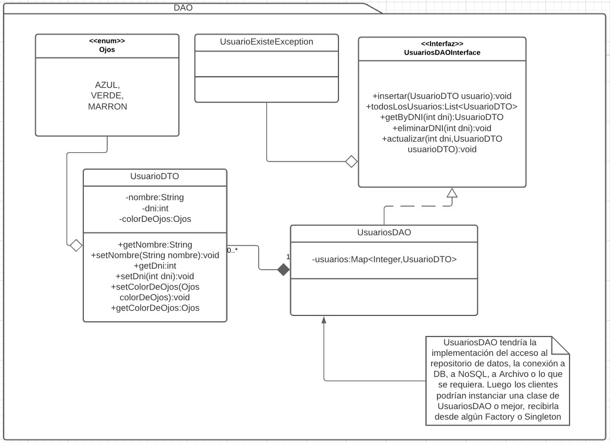

# DAO
[Link descripcion](https://www.tutorialspoint.com/design_pattern/data_access_object_pattern.htm)

El objetivo del DAO es crear una capa intermedia entre el negocio y el dato guardado en algún almacenamiento (DB, NoSQL, File) El DAO se encarga de buscar, eliminar o cualquier operación que requiera el proyecto recibiendo y devolviendo objetos DTO (POJOS).

## Diagrama de clases

## SOLID
* Single responsibility

El DAO tiene una sola responsabilidad que es la de proveer una capa de acceso al repositorio de datos.

* Open/Close principle

El dao puede heredarse o incluso ser simplemente una interfaz y que subclases concretas tengan la logica de acceso. Si se requiere acceder a un nuevo repositorio con otra tecnología basta con crear una nueva implementación de la interfaz y estariamos cumpliendo con este principio.

* Liskov substitution

El patrón no se encuentra en conflicto con este principio, cualquier implementación o subclase de un DAO debe comportarse como su padre (de hecho la dependencia es inyectada generalmente mediante spring o algun otro framework, por lo que se usa mucho este principio)

* Interface segregation

Si tenemos un DAO que empieza a tener muchos métodos para acceder a los datos o empieza a responsabilizarse por más de un tipo de objeto (en el ejemplo el DAO solo trae Usuarios) Debería segregarse en DAOS más pequeños con una responsabilidad cada uno al mismo tiempo cumplimos con segregar la interfaz

* Dependency inversión

El dao en este ejemplo es una interfaz que tiene una clase concreta, el consumidor del DAO no tiene porque saber que implementación se está usando, le basta con conocer su interfaz. Este principio se cumple